# scRNAseq_nasal_influenza
Single-cell RNA seq analysis of nasal mucosa of influenza A virus infected mice 5 and 14 days post infection.
April 13, 2026

# Introduction 

## Single Cell Sequencing
All cells in a multicellular organ share the same genetic material, but their unique functions are defined by their distinct transcriptomes that reflect specialized gene expression patterns. Traditional bulk transcriptomics provides a global signal that obscures individual cell variations. Single-cell sequencing (scRNA-seq) allows researchers to profile the gene expression shifts in each cell at unique stages, functions, and after a particular event such as an infection (Jovic et al., 2022). 

## Viral infection and ISGs
Viral infections contribute significantly to global morbidity and mortality, as was seen with the recent COVID-19 pandemic. Research into how the host mechanisms combat viral infections are important to understanding how to enhance our immune response, and utilize host mechanisms in juxtaposing processes such as pharmaceutical development of immunosuppressants (Crosse et al., 2018). The innate immune system has evolved a range of detectors for pathogen markers, recognition pattern receptors, and signals which alert the host immune cells, including cytokines. One well-known antiviral cytokine is the interferon (IFN) family.  IFN can act in an autocrine and paracrine manner. It activates the Janus kinase signal transducer which activates transcription of signaling pathways, expressing IFN-stimulated genes (ISGs). ISGs manage a viral infection by alerting and priming immune cells to the pathogen and mounting an inflammatory and immune response (Crosse et al., 2018). Research into the mechanism and timing of how ISGs mount an immune response is important to better understanding how host mechanisms fight a viral infection. This single-cell RNA sequencing study will analyze mouse cell transcriptomes at various days post infection (dpi) of mice (n = 3) after influenza A virus (IAV) infection (Kazer et al., 2024).

## Comparison of tools
The Seurat R package was used to handle the Single-cell RNA sequencing data (scRNAseq) for its statistical power and efficient workflows. A study comparing Seurat to the python-based Scanpy found that when calculating log-fold changes, Seurat uses pseudocounts based on cluster size, while Scanpy uses a small fixed constant (10^-9), which can lead Scanpy to give more extreme values when a gene is expressed in only one group (Rich et al., 2024; Wolf et al., 2018). Also, Seurat correctly reverses the log transform before calculating the mean across all cells, whereas Scanpy reverses the log1p transform after calculating the mean, which is an erroneous order of operations. Memory issues associated with the heavy computational load of using Seurat were overcome using Narval cluster of Canada Compute.
DESeq2 was employed for differential expression (DE) analysis as it uses a negative binomial general linear model to get gene-wise dispersion estimates (Love et al 2014). This is preferred over the DE function of Seurat. The p-values provided by the Seurat analyses can be inflated as each cell is treated as a sample to conduct a Wilcoxon-rank sum test. Treating each cell as an individual sample displays the variation within an individual instead of among populations (Squair et al., 2021). DESeq2 instead uses ‘pseudobulk’ aggregation that subsets the cell types (organ, time of collection, mouse replicate, etc) of interest, extracts the raw counts for DE, and aggregates them to create a ‘pseudobulk’ RNA collection. A study of the standard Seurat Wilcoxon-rank sum test and DESeq2’s pseudobulk method found that pseudobulk more accurately predicted changes in protein abundance, and in gene ontology found that it more faithfully reflected the truth as identified by bulk RNA-seq (Squair et al., 2021). They found that single-cell methods are biased towards highly expressed genes and pseudobulk methods voided incorrectly identifying abundant spike-ins as differentially expressed genes (Squair et al., 2021). Hence, DESeq2 was chosen over Seurat to perform the differential expression analysis of genes.

This single-cell RNA sequencing experiment used scRNA sequencing reads from mice (n = 3) infected by Influenza A virus (IAV) and sampling from three organs of interest (respiratory mucosa: RM, olfactory mucosa: OM, lateral nasal gland: LNG).

# Methods 

## Quality control (scripts/1.filtering_scRNA.R).

All analyses were conducted on the Narval Canada Compute cluster using the r-bundle-bioconductor module (v3.21) to access a collection of important bioinformatics packages at once. R (v4.5.0) was used interactively in a Salloc interactive session and in Slurm jobs for longer processes. Plots were made with ggplot2 (v4.0.0) and patchwork (v.1.3.2). Quality control included several steps to evaluate the cell counts and gene counts in the samples as based on the workflow provided by the Harvard Chan Bioinformatics Core (HBC) (Piper et al., 2022). Using Seurat (v5.3.0)(Butler et al., 2018). The metadata of the Seurat object was assessed cell counts, UMI (unique molecular identifier) counts, genes features, complexity (ratio of number of genes / number of UMI), log10genes per UMI, and mitochondrial counts ratio. Joint filtering was done to assess good cells (high number of genes and UMIs) to avoid filtering for viable cell populations.  Cells were filtered by their mitochondrial ratio and complexity to avoid damaged or dying cells and artifacts. After visualization of the QC metrics and consideration of the filtering by Kazer et al. (2024), the final filtering used the subset function of the Seurat package and the following thresholds: 750 < nCount_RNA < 10000, nFeature_RNA > 500, log10GenesPerUMI > 0.8, mitochondrial ratio < 15%. This filtered from 25129 featutres across 156572 samples within 1 assay to 25129 features across 15672 samples within 1 assay. Gene-level filtering was done with GetAssayData() tp remove genes with zero counts and for genes expressed in less than 10 cells. The final filtered matrix was created as a Seurat object (24386 features across 154343 samples) using the CreateSeuratObject function and saved as an RDS object.

## Clustering and PCA (scripts/2.cluster_annotation_plot.R). 
Clustering, UMAP and PCA were done using the filtered Seurat object. This process was done sequentially (1 node) using 30GB memory, which was set using the future package (v1.70.0, Bengtsson, 2021). The SCTransform package was used to normalize the counts. The SCTransform function combines normalization of data with scaling, and calculates Pearson’s residuals. The parameters used include the filtered Seurat RDS as the object, vars.to.regress set to ‘mitoRatio’ to perform a non-regularized linear regression to remove the effect of the mitochondrial ratio from the Pearson residuals. This ensures that the mitochondrial variation does not drive downstream UMAP clustering or PCA. ‘conserve.memory = TRUE’ was enabled to ensure the function doesn’t build the full residual matrix for all genes at once, to be more energy efficient. ‘vst.flavor = “v2”’ set an updated sctransform method (as compared to v1, more efficient), and verbose = TRUE instructed the function to print the progress messages into the console. A PCA was run on the processed Seurat object using the RunPCA function, with features set to VariableFeatures(object = Seurat_rds) to ensure the PCA is run using the variable features for the Assay which are now present in the scaled data. An elbow plot was generated to find the bend in the PCs importance. UMAP was run with an initial 30 PCs to start and a resolution of 0.5, using the FindNeighbors function (using 30PCs to start) and the FindClusters function (using resolution of 0.5 to start), and the RunUMAP function (30 PCs to start).

## UMAP Clustering (scripts/3.DE_umap.R).
The UMAP clustering was done again after initial assessment of the PCA elbow plot and clusters at resolution of 0.5. The PCA showed that the first 16 PCs explained the most variability in the data, and a resolution of 0.5 gave 34 clusters. To improve the PCA and clustering so that it does not map to noisy signals, the PCA was run again with RunPCA, assay = “SCT” to use the SCTransform assay, npcs = 40 to calculate 40 PCs and have extras for the clustering after, verbose = TRUE to print the genes associated with high/low loadings for the PCs in the console, and seed.use = 42 which is the default to ensure reproducible clustering. Clustering was run again with FindNeighbors (16 PCs), FindClusters (resolution of 0.4 to reduce the number of clusters), and RunUMAP (16 PCs). The markers were searched for using FindAllMarkers and the filtered and processed Seurat object, only.pos = TRUE to identify only upregulated markers (positive), min.pct = 0.25 to identify set genes in at least 25% of cells, and logfc.threshold of 0.25 to set that genes must be at least 1.2X higher than other clusters.

## Manual annotation (scripts/4.checking_cluster_csv.R). 
Manual annotation was done by consulting the top 10 markers for each cluster (by descending average log2 fold-change) and using the authors annotations of cell clusters (Kazer et al., 2024, data/ NIHMS2007656-supplement-2.xlsx). The final list of markers was made using the dplyr package (v1.1.4, Wickham et al., 2026) and filtering for significant markers (p_val_adj < 0.05) and slicing the top 10 markers (descending order by average log2 fold change). Cell cluster names were manually added to a column (cell_type) using unname() and setting the identify of the column SCT_snn_res.0.4 (clusters of resolution 0.4).

## DE and GSEA (scripts/6.DE_GSEA.R).
Samples were subsetted for DE and GSEA based on organ (RM and OM) and timepoints of interest (Naïve, dpi 5, dpi 14) (154k cells filtered to 71k cells). DE was done by first pseudobulk aggregation using AggregateExpression(), assays = “RNA” (RNA sequencing”, return.seurat = TRUE, and group.by = sample, cell type, day, organ, and mouse ID. The comparison ID (cell_time_organ) was created and set as the Identity for comparison (cell_time_organ). DE was run in a loop with FindMarkers(), the object set to the pseudbulked Seurat, the identities to compare being the two time points (Naïve vs. D05, Naïve vs. D14). The logfc.threshold was set to 0.2 (above the 0.1 default) to limit tests to genes that show a higher average log fold change groups of cells, the test.use = DESeq2 was set to ensure DESeq2 is the statistical test run, the slot = “counts” was set as DESeq2 needs raw counts. The GSEA was run on an independent PC as the Narval cluster does not have the clusterProfiler (v4.16.0) package and the mouse database used (Org.Mm.eg.db, v3.21.0)(Yu et al., 2012). The GSEA was conducted with gseGO(), the gene_list sorting genes in descending order by their avg_log2FC, the mouse database set to org.Mm.eg.db (v3.21.0), the keytype = “SYMBOL”, the ont = “BP” for biological processes, pvalueCutoff = 0.05 for significant genes, minGSSize = 10 to get minimal size of each geneSet for analyzing in at least 10 genes, and maxGSSize = 500 to avoid genes in many cells and broad pathways. The p-values were adjusted with the Benjamini-Hochberg (BH) procedure.

# Results 

## QC 
The raw dataset consisted of 156,572 cells across 25,129 features. Preliminary QC showed an imbalance in cell distribution across organs, with the OM and RM contributing the highest cell counts compared to LNG samples (**Figure 1C**). QC metrics showed high sequencing depth (UMI counts > 3000) and high library complexity (log10 genes per UMI > 0.8) (**Figure 1A**). Mitochondrial ratios generally peaked below 10%, indicating high cell viability (**Figure 1D**). After filtering, the final processed Seurat object contained 154,343 cells and 24,386 genes, representing a 98.6% data retention.

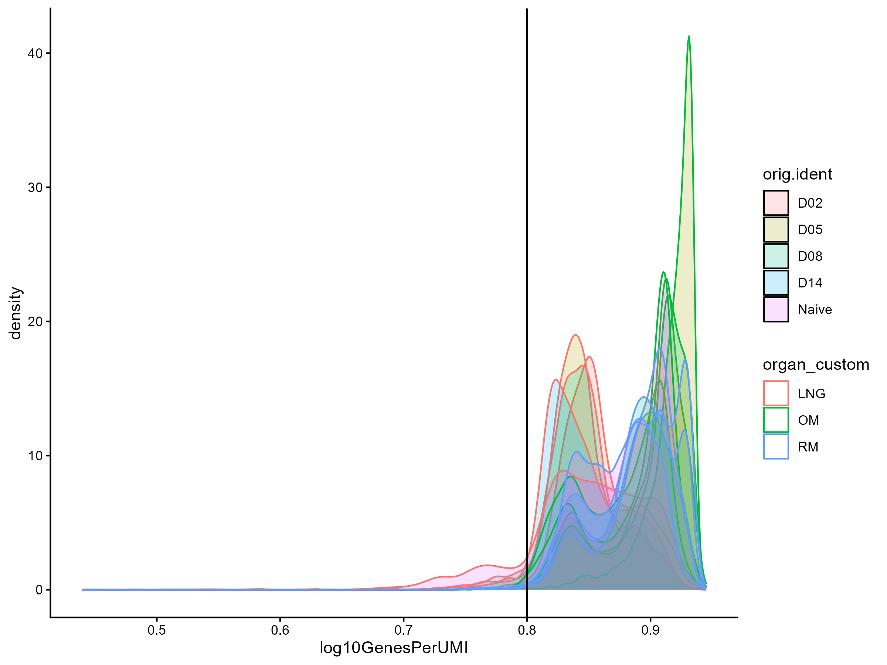
 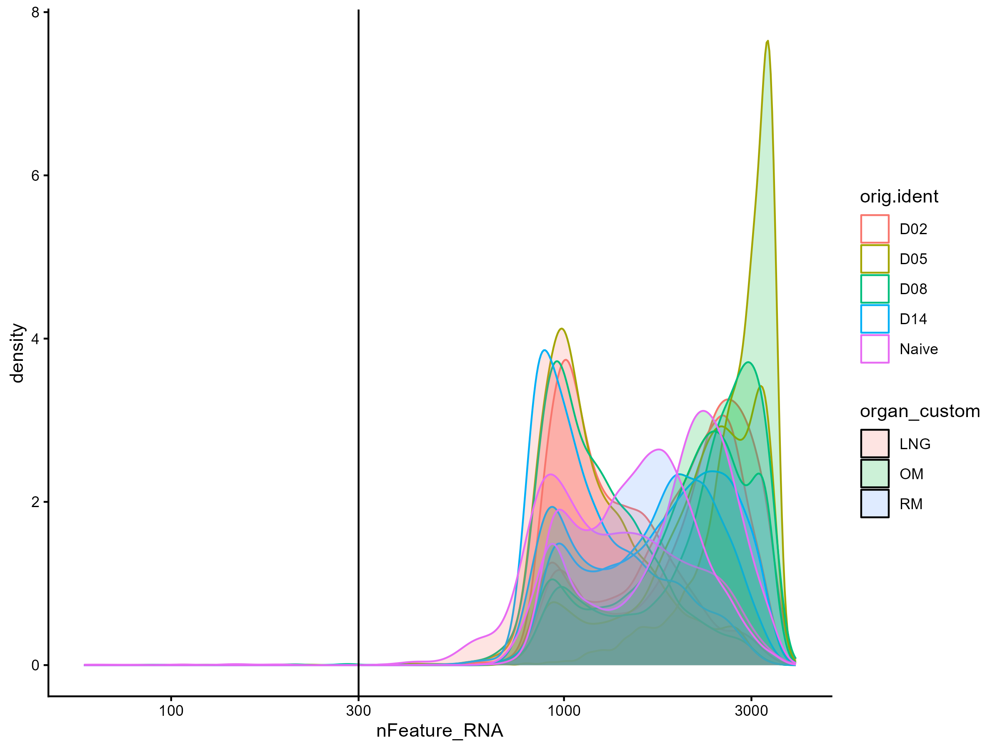 
 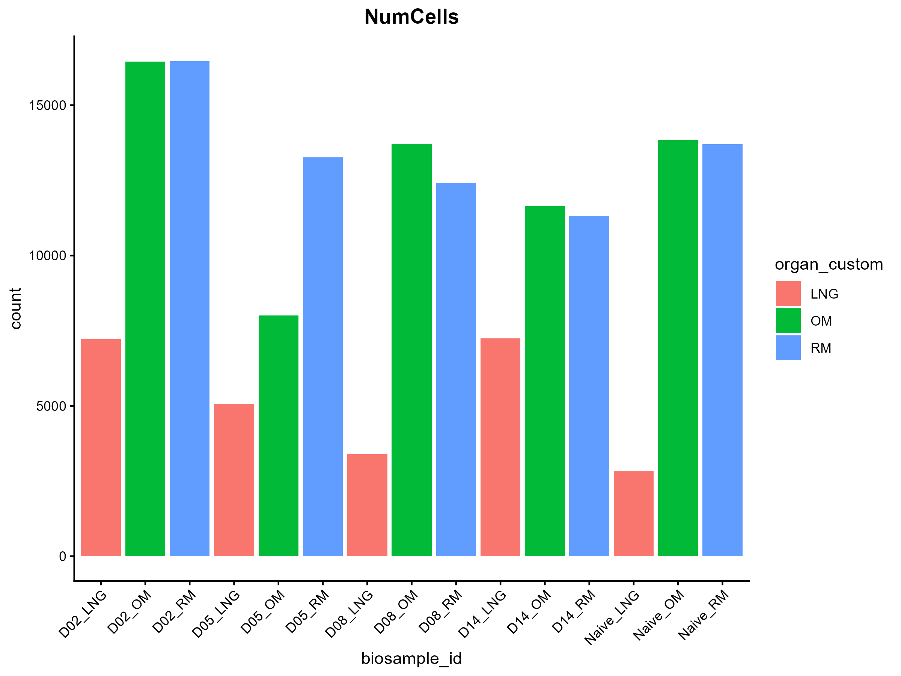 
 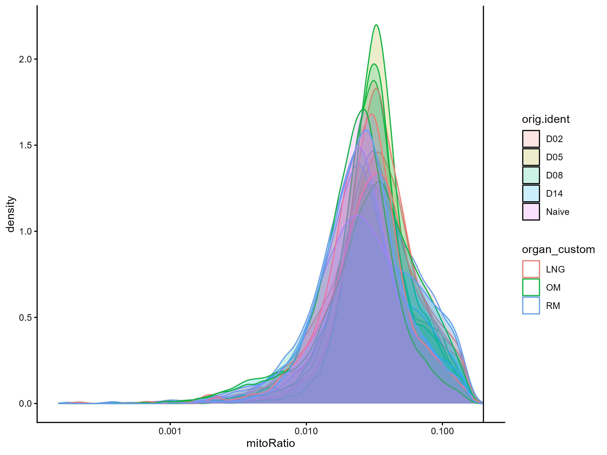 

**Figure 1: Quality Control raw of scRNA-seq Data**. (A) Distribution of unique molecular identifiers (UMI) per cell, coloured by organ and time of collection. B) Distribution of genes (nFeature_RNA) per cell (cell density). C) Bar plot of number cells per collected sample. D) Distribution of the mitochondrial ratio of the read counts. organ_custom: Organ collected from, RM: respiratory mucosa, OM: olfactory mucosa, LNG: lateral nasal gland, orig.ident: time of sample collection, D: day post infection, Naive is baseline, nFeature_RNA: gene, biosample_id: ID indicating time of collection and organ type, mitoRatio: mitochondrial ratio of reads. Experiment conducted in triplicate.

## Clutering annotation

Clustering at a resolution of 0.4 using 16 PCs identified 27 clusters, which were manually merged into 25 distinct cell types (**Table 1**). UMAP visualization revealed clear linear separation between immune, epithelial and neuronal compartments (**Figure 2**). A large olfactory sensory neuron (OSN) cluster comprising Dlg2+, Calb2+, and Mature OSNs, localized to the right of the UMAP. Immunr populations, including interferon-stimulated dendritic cells (IFN-Stim DC), macrophages, and B cells, were clustered centrally. Epithelial populations (glandular, serous, and ionocytes) were localized to the top-left. Neuronal cells took up the center of UMAP 1 and neural progenitors localized close to the OSN clusters (**Figure 2**).

 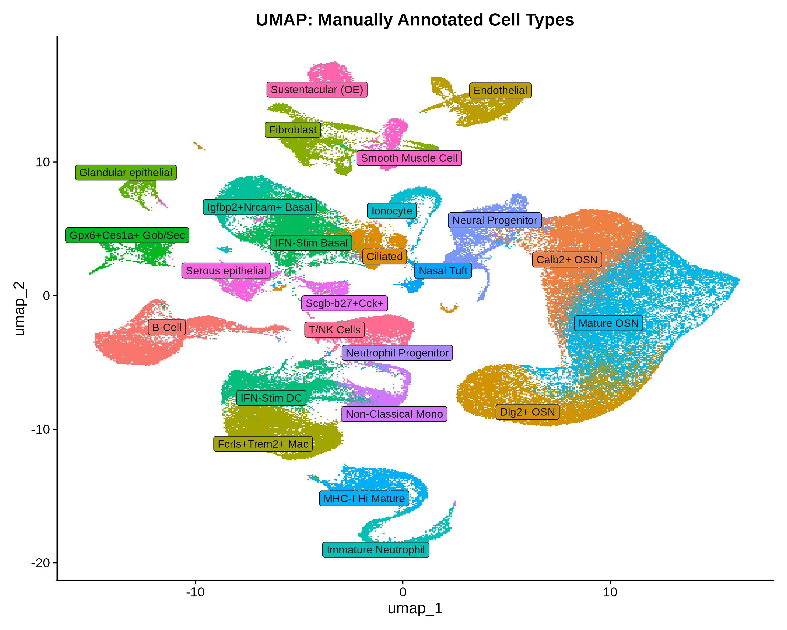 
**Figure 2: Manually Annotated UMAP**. Dimensionality reduction via UMAP with a resolution of 0.4 and 16PCs highlighting 25 distinct cell lineages. Clusters are coloured by cell type, with prominent immune cells central, neuronal to the right, and epithelial at the left.

**Table 1: Manually annotated cell clusters based on the top 10 markers with cluster number, cell type, top 5 marker genes and number of cells per cluster.**
| Cluster Number|Cell Type|Marker Genes (top 5)|Classified Cells (#)|
| :--- | :---: | :---: |---:|
| 0 | Calb2+ OSN |B830017H08Rik, Calb2, Nqo1, Kirrel3, Rims3| 15109 |
| 1 |Mature OSN| Ano2, Gramd1c, Stoml3, Gldc, Gm6878|14558  |
| 2 | Fcrls+Trem2+ Mac | Fcrls, Ms4a7, C1qa, C1qc, Pf4 | 11456 |
| 3 |IFN-Stim Basal |	Acaa1b, Serpinb5, Krt15, Defb1, Anxa8 |10696 |
| 4 |B-cell |	Cd79a, Iglc1, Iglc2, Igkc, Pax5 | 10124  |7472 |
| 5 |Dlg2+ OSN	|Hectd2os, S100a5, Rgs7, Kcnmb3, Lrrc3b| 7313  |
| 6 |Fibroblast	|Col1a1, Lum, Omd, Wif1, Col1a2|7057  |
| 7 |Neural Progenitor	|Nhlh1, Thsd7b, Gng8, Cnpy1, Sox11|6912   |
| 8 |IFN-Stim DC	|Cd209a, Ifi205, Phf11a, Tnfsf9, Ms4a4c| 6664  |
| 9 |Endothelial	|Gpihbp1, Ptprb, Rbp7, Sox18, Sox17| 6588  |
| 10 |T+NK	|Gzma, Prf1, Sh2d1a, Cd3g, Cd3e| 5413  |
| 11 |Dlg2+ OSN|Dlg2, S100a5, Pcp4l1, Nphs1, Hectd2os|4904|
| 12 |MHC-I Hi Mature	|Cxcr2, Stfa2l1, Clec4d, Acod1, Il1r2|4904 |
| 13 |Ciliated	|AU040972, Bpifa1, Reg3g, Tff2, Ttc36|4842   |
| 14 |Igfbp2+ Nrcam+ Basal	|Car10, Abca4, Nrcam, Vit, Slc47a1| 4605  |
| 15 |Non-Classical Mono|Adgre4, F10, F13a1, Treml4, Ear2| 4018  |
| 16 |Mature OSN	|Adcy3, Umodl1, Mslnl, Stom, Ano2|3935   |
| 17 |Gpx6+Ces1a+ Gob/Sec	|Chil6, 5430419D17Rik, Bpifb4, Gpx6, Vmo1| 3510  |
| 18 |Ionocyte	|Kl, Smbd1, Coch, Clcnka, Galnt13| 3214  |
| 19 |Serous epithelial	|Tac1, Wfdc18, Barx2, Cited4, Bglap3|2915   |
| 20 |Immature Neutrophil	|Camp, Ngp, 4930438A08Rik, Fcnb, Itgb2l| 2837  |
| 21 |Smooth Muscle Cell	|Map3k7cl, Higd1b, Gm13861, Pln, Myh11|2692   |
| 22 |Sustentacular (OE)	| Muc2, Gldn, Sec14l3, Nipal1, Tex33|1665   |
| 23 |Scgb-b27+Cck+	|Car6, Scgb2b27, Scgb1b27, Csn3, Fbp1|1665   |
| 24 |Glandular epithelial|Bpifb9a, Bpifb9b, Bpifb5, Odam, 2310003L06Rik|1568   |
| 25 |Nasal Tuft|Hmx3, Il25, Trpm5, Sh2d7, Avil|1244|
| 26 |Neutrophil Progenitor	|Car1, Ctsg, Mpo, Prtn3, Elane| 567|

## Feature map plots
Feature map plots validated cluster identity and localization for clusters 8 and 3 (**Figure 3**).Immune clusters had *Cd209a* and *Ifi205* specific to IFN-Stim DC cluster. *Ms4a4c* was instead shared between stimulated DCs and non-classical monocytes. *Tnfsf9* was found by Kazer et al. only in DC clusters, and it was localized at a very low expression in the IFN-Stim DC cluster, suggesting it is a baseline DC marker but not stimulated by interferons(**Figure 3A**). Dlg2 was strictly localized to the *Dlg2+* cluster, while *S100a5* and *Pcp4l1*, which are activity-dependent genes stimulated by odor, showed broader distribution in the OSN clusters (**Figure 3B**).

   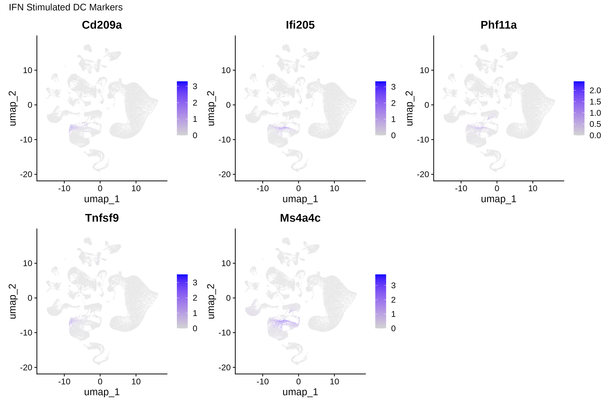 
 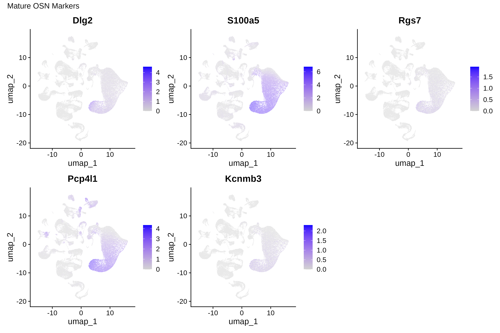 

**Figure 3:** Feature maps displaying the localization of specific marker genes in the transcriptomic landscape. A)Markers specific to the IFN-stimulated dendritic cell cluster cluster 3). B) Neuronal markers specific to mature olfactory sensory neurons (OSNs). Colour indicates relative expression as per normalized log-counts, with blue indicating higher expression. 

## DE 
DE analysis of cluster 8 (IFN-stim DC) in the RM showed a transcriptomic shift from acute defense at 5 dpi to recovery at 14 dpi, when compared with Naïve cells. At 5 dpi (D05), a strong shift from the naïve state is shown by the robust and uniform induction of ISGs including *Isg15*, *Rsad2*, and *Cxcl10*. These mark the ‘defensive’ antiviral state of the cell. Biological variation was seen among replicates (column 1), though the direction of change was consistent across replicates (**Figure 4A**). At 14 dpi, the transcriptome did not fully return to baseline levels but showed a less defensive profile as the ISGs were no longer induced (**Figure 4B**). Instead, ribosomal (*Rps27rt*) and mitochondrial genes were activated (*mt-Atp8*). There is one mouse replicate (column 1) that shows a different pattern to other D14 mice. It is far from the intermediate expression seen in both baseline and other D14 replicates, suggesting it is slower to reach the recovery stage than the other mice(**Figure 4B**).
  
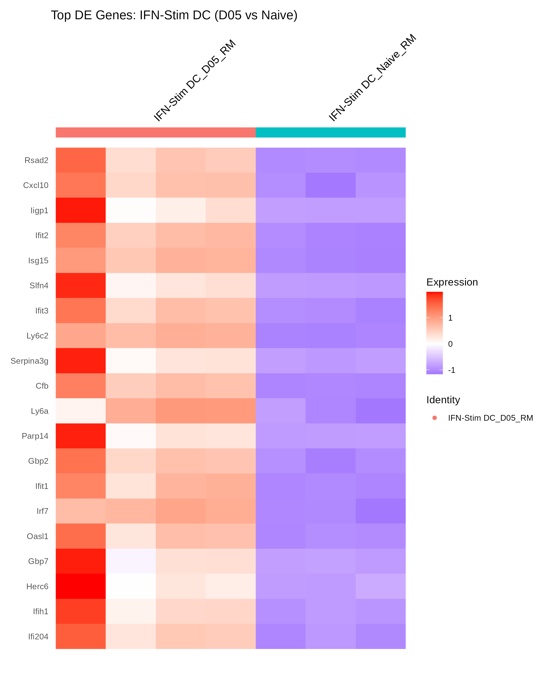 
 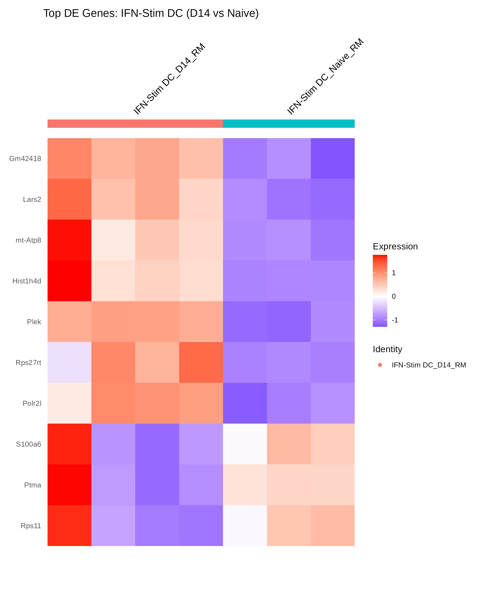 
**Figure 4: Heat Map** Heat map of the top genes differentially expressed between cluster 8 (IFN Stim DC). A) top 20 genes differentially expressed between 5 dpi vs. Naive, B) top 10 genes differentially expressed between 14 DPI vs. Naive. RM: respiratory mucosa, D05: 5 dpi, D14: 14 dpi, DE: differential expression, Identity: biosample ID indicating cluster, dpi, and organ, separated by underscore.

## Gene set enrichment analysis (GSEA) 
GSEA of cluster 8 confirmed the biological transitions seen in the DE analysis (**Figure 5**). At 5 dpi, the upregulated pathways surrounded viral defense response and interferon-beta signaling (**Figure 5A**). At 14 dpi, there was a shift toward B cell differentiation and mRNA stability regulation, and a small downregulation of sensory perception pathways (**Figure 5B**). This function shift highlights a transient shift in the transcriptome between acute antiviral states and the recovery response.

 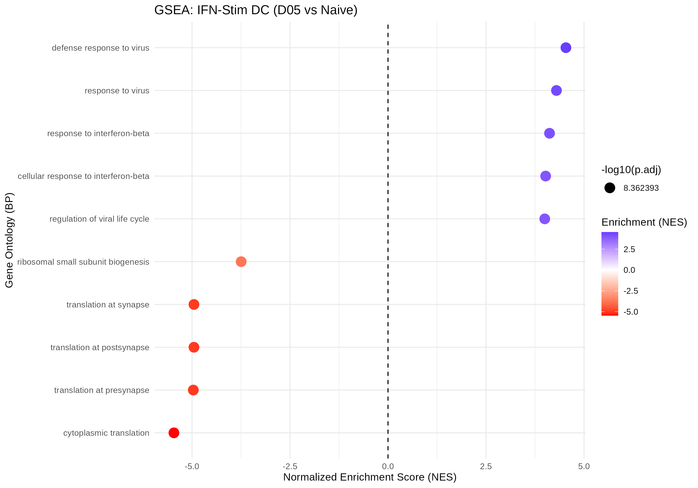 
 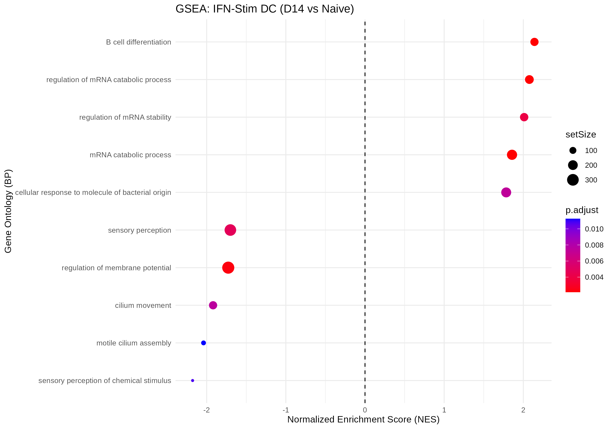

**Figure 5: Gene set analysis pathway enrichment in IFN-stim DCs**. Dot plots showing the Normalized Enrichment Scores (NES) for top Biological Process (BP) terms. A) 5 dpi (D05) vs naive B) 14 dpi (D14) vs naive. p.adjust: adjusted p-value by Benhamini Hochberg, point size: number of genes associated with pathway, Naive: baseline. 

# Discussion

## Data integrity
This single-cell RNA sequencing experiment used scRNA sequencing reads from mice infected by Influenza A virus (IAV) and sampling from three organs of interest (respiratory mucosa: RM, olfactory mucosa: OM, lateral nasal gland: LNG). The high retention rate of cells after the quality control process (98.6%) highlight that the initial library was high-quality. The bi-modal distribution of cells when plotting genes per cell showed an overrepresentation of 5 dpi of cells with a high gene count, specifically in the OM and RM. The lower gene count featured 14 dpi and the LNG organ (**Figure 1B**). This suggests that there were more transcriptionally active cells in the OM and RM acutely after infection. The upregulated pathways previously identified in mice transcriptomes post-infection include  neuronal, immune and inflammation (Al-Shalan et al., 2023).  

## UMAP alignment and cluster identities
While Kazer et al. yielded a total of 127 clusters at a resolution of 0.6, this analysis yielded 27 clusters at a resolution of 0.4, of which some were merged into 25 clusters (Kazer et al., 2024). Nonetheless, the manual annotation of the clusters strongly aligns with those of Kazer et al., namely the endothelial and fibroblasts at the top, neurons in the far right in a large cluster, immune cells at the center, and epithelial at the top left (Kazer et al., Figure 1C, 2024). The localization of marker genes through feature map plots provide spatial validation of the transcriptomic landscape and clustering. The presence of *S1005A* and *Pcp4l1* broadly distributed across the olfactory sensory neuron OSN cluster highlight their broad function as activity-dependent genes(**Figure 3B**). These mRNAs are known to be positively regulated by odor, as they are calcium-binding proteins that have been linked to the cAMP pathway and electrical activity and downstream signals following odor sensation (Fischl et al., 2014). These highlight their role in neuronal cells and their localized presence in the OSN clusters. The small localization of Dlg2 to the Dlg2+ cluster highlights its very specific role to specially differentiated OSNs (**Figure 3A**). Mechanistic studies have linked Dlg2 to affective disorders including autism spectrum disorder and schizophrenia (Yoo et al., 2020). It acts as a membrane-associated scaffolding protein for receptors in the synapse and is important for excitatory postsynaptic receptors (Yoo et al., 2020).

## Acute antiviral response
The 5 dpi response in cluster 8 (IFN-Stim DC) the DE analysis of cluster 8 (IFN-Stim DC) showed upregulation of several IFN-stimulated genes (ISG). These included *Isg15, Rsad2*, and *Cxcl10* (**Figure 4A**). CXCL10 mediates inflammation, highlighting its notable role as an ISG and its importance in mounting an inflammation response to a pathogen (Mostafavi et al., 2016). These were also IFN stimulated genes seen in human immune responses to acute HIV infection (Mackelprang et al., 2023). GSEA showed that IFN-stim DC from 5 dpi to Naïve state showed a strong response to a viral infection. *Rsad2* encodes the antiviral protein viperin, which has been shown to be an effective antiviral for IAV, but also other globally impactful viruses are susceptible including West Nile Virus, hepatitis C virus, and rhinovirus (Crosse et al., 2018). It has been mapped as a member of the NF-kB pathway which activates transcription of proinflammatory cytokines. Viperin is one of the most highly-induced IF effector proteins. In IAF infections, overexpression of viperin inhibits the budding and release of influenza A virions from infected cells by altering the fluidity of the plasma membrane and its lipid rafts (Hinson et al., 2010). DCs in mice infected with Lymphocytic choriomeningitis virus (LCMV) showed delayed expression of viperin (peaking at day 3) compared to other cell types (Hinson et al., 2010). DCs are important fo the IFN-stimulated immune response by priming T cells during the initial stage of infection. Therefore, it is likely that the cluster of IFN-Stim DCs upregulates viperin immediately after infection to prime T cells and inhibit further virion release from the plasma domains of infected cells. 

## Mitochondrial compensation
DE found that 14 dpi showed upregulation of mitochondrial genes including *mt-Atp8* (**Figure 4B**), which is one of the two mtDNA polypeptides that composes the complex V of electron transport chain (Guarnieri et al., 2023). Host cells of humans with COVID-19 infection showed an upregulation of electron transport chain complex genes immediately after COVID-19 recovery and a time-dependent tapering off of these genes in part due to host cell’s compensatory upregulation of nuclear mitochondrial genes (Twum et al., 2025). Therefore, the mouse response to the viral infection may lead to compensatory upregulation of mitochondrial genes post-infection, to build complexes of the electron-transport chain to support energy production during recovery. 

## Host Shut-off
The downregulated pathways all involve translation. This “host shut-off” occurs as the virus infection impairs ongoing protein synthesis in host machinery, to limit production of host defense proteins and allow viral mRNA to better compete for translation by the host ribosomes (Stern-Ginossar et al., 2019). Hence, the downregulation of translation pathways indicates a “host shut-off” induced by the viral infection, to antagonize host defenses and overtake translational machinery to produce viral proteins (**Figure 5B**). 

## Limitations
The limitations of this study include the lack of filtering for doublets during QC. Kazer et al. (2024) filtered aggressively for doublets at multiple stages of QC, whereas this study did not include them. Future pruning of the cells should identify potential clusters with doublets as clusters expressing multiple contrasting cell-type markers, to improve specificity of the clustering. Additionally, manual annotation should be compared to automated annotation of clusters to identify doublets or misclustered cells.

## Conclusion
This study delineates the temporal shift in the nasal mucosa from a baseline healthy state, to an acute viral-defense state driven by interferon stimulation of immune cells. Characterizing the transient nature of ISG expression and subsequent host-shut off and mitochondrial compensation provides insight into the host’s ability to mount an immune response and handle a pathogen infection. Future research should further explore the various specific roles of each cell type in the immune response and basic olfactory functions.

# References

Al-Shalan, H. A. M., Hu, D., Wang, P., Uddin, J., Chopra, A., Greene, W. K., & Ma, B. (2023). Transcriptomic Profiling of Influenza A Virus-Infected Mouse Lung at Recovery Stage Using RNA Sequencing. Viruses, 15(11), 2198. *https://doi.org/10.3390/v15112198*

Bengtsson H (2021). “A Unifying Framework for Parallel and Distributed Processing in R using Futures.” The R Journal, 13(2), 208–227.*https://doi.org/10.32614/RJ-2021-048*

Butler, A., Hoffman, P., Smibert, P., Papalexi, E., & Satija, R. (2018). Integrating single-cell transcriptomic data across different conditions, technologies, and species. Nature Biotechnology, 36(5), 411–420.*https://doi.org/10.1038/nbt.4096*

Crosse, K. M., Monson, E. A., Beard, M. R., & Helbig, K. J. (2018). Interferon-Stimulated Genes as Enhancers of Antiviral Innate Immune Signaling. Journal of Innate Immunity, 10(2), 85–93. *https://doi.org/10.1159/000484258*

Fischl, A. M., Heron, P. M., Stromberg, A. J., & McClintock, T. S. (2014). Activity-Dependent Genes in Mouse Olfactory Sensory Neurons. Chemical Senses, 39(5), 439–449. *https://doi.org/10.1093/chemse/bju015*

Guarnieri, J. W., Dybas, J. M., Fazelinia, H., Kim, M. S., Frere, J., Zhang, Y., Albrecht, Y. S., Murdock, D. G., Angelin, A., Singh, L. N., Weiss, S. L., Best, S. M., Lott, M. T., Zhang, S., Cope, H., Zaksas, V., Saravia-Butler, A., Meydan, C., Foox, J., … Wallace, D. C. (2023). Core mitochondrial genes are down-regulated during SARS-CoV-2 infection of rodent and human hosts. Science Translational Medicine, 15(708), eabq1533. *https://doi.org/10.1126/scitranslmed.abq1533*

Hinson, E. R., Joshi, N. S., Chen, J. H., Rahner, C., Jung, Y. W., Wang, X., Kaech, S. M., & Cresswell, P. (2010). Viperin is highly induced in neutrophils and macrophages during acute and chronic LCMV infection. Journal of Immunology (Baltimore, Md. : 1950), 184(10), 10.4049/jimmunol.0903752. *https://doi.org/10.4049/jimmunol.0903752*

Jovic, D., Liang, X., Zeng, H., Lin, L., Xu, F., & Luo, Y. (2022). Single‐cell RNA sequencing technologies and applications: A brief overview. Clinical and Translational Medicine, 12(3), e694. *https://doi.org/10.1002/ctm2.694*

Kazer, S. W., Match, C. M., Langan, E. M., Messou, M.-A., LaSalle, T. J., O’Leary, E., Marbourg, J., Naughton, K., von Andrian, U. H., & Ordovas-Montanes, J. (2024). Primary nasal influenza infection rewires tissue-scale memory response dynamics. Immunity, 57(8), 1955-1974.e8. *https://doi.org/10.1016/j.immuni.2024.06.005*

Love, M. I., Huber, W., & Anders, S. (2014). Moderated estimation of fold change and dispersion for RNA-seq data with DESeq2. Genome Biology, 15(12), 550. *https://doi.org/10.1186/s13059-014-0550-8*

Mackelprang, R. D., Filali-Mouhim, A., Richardson, B., Lefebvre, F., Katabira, E., Ronald, A., Gray, G., Cohen, K. W., Klatt, N. R., Pecor, T., Celum, C., McElrath, M. J., Hughes, S. M., Hladik, F., Cameron, M. J., & Lingappa, J. R. (2023). Upregulation of IFN-stimulated genes persists beyond the transitory broad immunologic changes of acute HIV-1 infection. iScience, 26(4), 106454. *https://doi.org/10.1016/j.isci.2023.106454*

Mostafavi, S., Yoshida, H., Moodley, D., LeBoité, H., Rothamel, K., Raj, T., Ye, C. J., Chevrier, N., Zhang, S.-Y., Feng, T., Lee, M., Casanova, J.-L., Clark, J. D., Hegen, M., Telliez, J.-B., Hacohen, N., De Jager, P. L., Regev, A., Mathis, D., & Benoist, C. (2016). Parsing the Interferon Transcriptional Network and Its Disease Associations. Cell, 164(3), 564–578. *https://doi.org/10.1016/j.cell.2015.12.032*

Pedersen T (2025). patchwork: The Composer of Plots. R package version 1.3.2.9000. *https://patchwork.data-imaginist.com*

Piper, M., Mistry, M., Liu, J., Gammerdinger, W., & Khetani, R. (2022). hbctraining/scRNA-seq_online: scRNA-seq Lessons from HCBC (first release) (Version v1.0.0). Zenodo. *https://doi.org/10.5281/ZENODO.5826256*

Rich, J. M., Moses, L., Einarsson, P. H., Jackson, K., Luebbert, L., Booeshaghi, A. S., Antonsson, S., Sullivan, D. K., Bray, N., Melsted, P., & Pachter, L. (2024). The impact of package selection and versioning on single-cell RNA-seq analysis. bioRxiv, 2024.04.04.588111. *https://doi.org/10.1101/2024.04.04.588111*

Squair, J. W., Gautier, M., Kathe, C., Anderson, M. A., James, N. D., Hutson, T. H., Hudelle, R., Qaiser, T., Matson, K. J. E., Barraud, Q., Levine, A. J., La Manno, G., Skinnider, M. A., & Courtine, G. (2021a). Confronting false discoveries in single-cell differential expression. Nature Communications, 12(1), 5692. *https://doi.org/10.1038/s41467-021-25960-2*

Squair, J. W., Gautier, M., Kathe, C., Anderson, M. A., James, N. D., Hutson, T. H., Hudelle, R., Qaiser, T., Matson, K. J. E., Barraud, Q., Levine, A. J., La Manno, G., Skinnider, M. A., & Courtine, G. (2021b). Confronting false discoveries in single-cell differential expression. Nature Communications, 12(1), 5692. *https://doi.org/10.1038/s41467-021-25960-2*

Stern-Ginossar, N., Thompson, S. R., Mathews, M. B., & Mohr, I. (2019). Translational Control in Virus-Infected Cells. Cold Spring Harbor Perspectives in Biology, 11(3), a033001. *https://doi.org/10.1101/cshperspect.a033001*

Twum, E., Baranova, A., & Ullah, A. (2025). Peripheral blood, lung and brain gene signatures in recovered and deceased patients with COVID-19. In Silico Pharmacology, 13(3), 159. *https://doi.org/10.1007/s40203-025-00450-1*

Wickham, H. ggplot2: Elegant Graphics for Data Analysis. Springer-Verlag New York, 2016.

Wickham H, François R, Henry L, Müller K, Vaughan D (2026). dplyr: A Grammar of Data Manipulation. R package version 1.2.1. *https://dplyr.tidyverse.org*

Wolf, F. A., Angerer, P., & Theis, F. J. (2018). SCANPY: Large-scale single-cell gene expression data analysis. Genome Biology, 19(1), 15. *https://doi.org/10.1186/s13059-017-1382-0*

Yoo, T., Kim, S.-G., Yang, S. H., Kim, H., Kim, E., & Kim, S. Y. (2020). A DLG2 deficiency in mice leads to reduced sociability and increased repetitive behavior accompanied by aberrant synaptic transmission in the dorsal striatum. Molecular Autism, 11, 19. *https://doi.org/10.1186/s13229-020-00324-7*

Yu, G., Wang, L.-G., Han, Y., & He, Q.-Y. (2012). clusterProfiler: An R Package for Comparing Biological Themes Among Gene Clusters. OMICS : A Journal of Integrative Biology, 16(5), 284–287. *https://doi.org/10.1089/omi.2011.0118*

